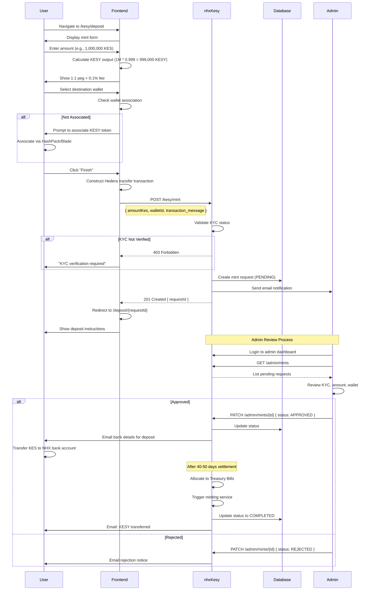
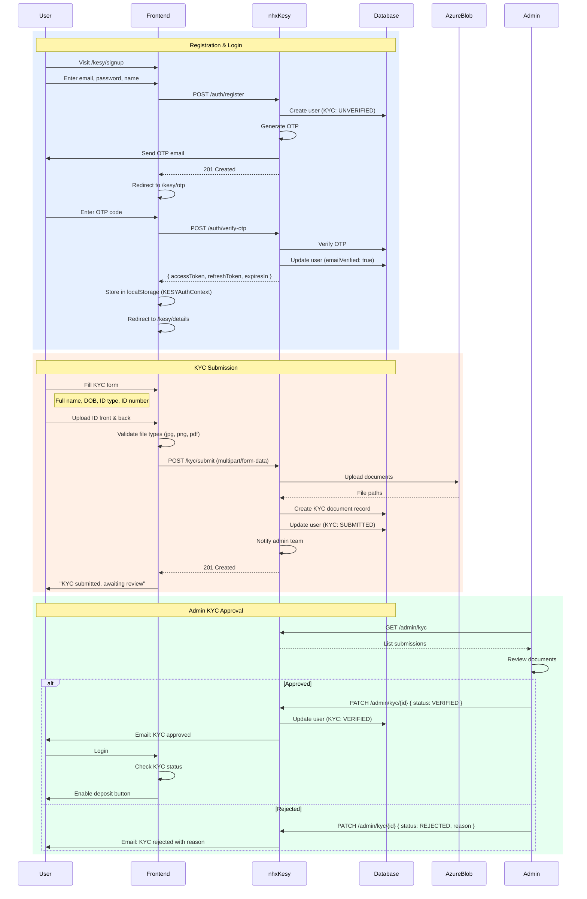

# NHX Finance

**KESY Stablecoin Platform**

NHX Frontend is a Next.js-based decentralized application (dApp) that provides institutional access to KESY, a Kenyan Shilling-backed stablecoin on the Hedera network. Built with modern web technologies, it enables institutions to mint, manage, and redeem KESY tokens with full KYC compliance and regulatory oversight.

[](https://nextjs.org/)
[](https://reactjs.org/)
[](https://www.typescriptlang.org/)
[](https://hedera.com/)

---

## Table of Contents

- [Architecture Overview](#architecture-overview)
- [Key Features](#key-features)
- [Technical Stack](#technical-stack)
- [System Architecture](#system-architecture)
- [KESY Workflows](#kesy-workflows)
- [KESY Token Integration](#kesy-token-integration)
- [Getting Started](#getting-started)
- [Project Structure](#project-structure)
- [API Integration](#api-integration)
- [Security](#security)
- [License](#license)

---

## Architecture Overview

NHX Frontend is built on a modern **JAMstack** architecture, leveraging Next.js 15's App Router for server-side rendering and optimal performance. The application integrates with the nhx-kesy backend for institutional KYC, minting workflows, and wallet management, while connecting to Hedera blockchain for token operations.

```
┌─────────────────────────────────────────────────────────────┐
│                      User Interface Layer                    │
│  ┌─────────────┬──────────────┬──────────────┬────────────┐ │
│  │   Landing   │ Auth/Signup  │  Dashboard   │   Deposit  │ │
│  │    Page     │   + KYC      │   Overview   │  (Minting) │ │
│  └─────────────┴──────────────┴──────────────┴────────────┘ │
└─────────────────────────────────────────────────────────────┘
                              │
                              ▼
┌─────────────────────────────────────────────────────────────┐
│                   State Management Layer                     │
│  ┌──────────────────────┬──────────────────────────────────┐│
│  │  TanStack Query      │   React Context                  ││
│  │  (Server State)      │   (KESY Auth, Theme)             ││
│  └──────────────────────┴──────────────────────────────────┘│
└─────────────────────────────────────────────────────────────┘
                              │
                              ▼
┌─────────────────────────────────────────────────────────────┐
│                   Integration Layer                          │
│  ┌──────────────┬──────────────┬─────────────────────────┐ │
│  │  nhx-kesy    │   Hedera SDK │    Wallet Service       │ │
│  │  Backend API │   (Direct)   │    (M-Pesa Bridge)      │ │
│  └──────────────┴──────────────┴─────────────────────────┘ │
└─────────────────────────────────────────────────────────────┘
                              │
                              ▼
┌──────────────────────────────────────────────────────────────────┐
│                    Blockchain Layer                          │
│  ┌──────────────────────────────────────────────────────┐  │
│  │           Hedera Testnet (Chain ID: 296)             │  │
│  │  • KESY Token (0.0.6883537)                          │  │
│  │  • Stablecoin Studio Contracts                       │  │
│  │  • HTS (Hedera Token Service)                        │  │
│  └──────────────────────────────────────────────────────┘  │
└──────────────────────────────────────────────────────────────────┘
```

---

## Key Features

### 🔐 **Authentication & User Management**

- JWT-based authentication with refresh token rotation
- Email/password registration with OTP verification
- Secure session management with automatic token expiry
- Protected routes with authentication guards
- KYC verification workflow for compliance

### 💰 **KESY Token Operations**

- **Minting (Deposit)**: Institutional deposit workflow for minting KESY tokens
- **Minimum Deposit**: 1,000,000 KES for institutional accounts
- **Processing Fee**: 0.1% minting fee
- **1:1 Peg**: KESY pegged to Kenyan Shilling (1 KESY = 1 KES)
- **Backed by Treasury Bills**: Fully collateralized by Kenyan government securities

### 🏦 **Wallet Management**

- **Multi-Wallet Support**: Create and manage multiple Hedera wallets
- **Token Association**: Automatic HTS token association for KESY
- **Whitelisting**: KYC-verified wallets for compliance
- **Transaction History**: Complete audit trail of all operations

### 📊 **Dashboard & Monitoring**

- Real-time KESY balance tracking
- Mint request status monitoring
- Wallet management interface
- Transaction history and activity logs
- KYC status tracking

### 🔒 **Compliance & Security**

- KYC/AML verification required for all users
- VASP Bill 2025 compliant
- Admin approval workflow for mint requests
- Secure document upload for KYC verification

---

## Technical Stack

### **Frontend Framework**

- **Next.js 15.5.4**: React framework with App Router, Turbopack, Server Components
- **React 19.1.0**: UI library with concurrent features
- **TypeScript 5.0**: Type-safe development

### **Blockchain Integration**

- **Hedera SDK**: Direct integration for transaction construction
- **Hedera Testnet**: Layer 1 blockchain (Chain ID: 296)
- **HTS (Hedera Token Service)**: Native token operations

### **State Management**

- **TanStack Query 5.90.5**: Async state management and caching
- **React Context API**: Global state (auth, theme)
- **React Hook Form 7.65.0**: Form state management with Zod validation

### **UI/UX**

- **Tailwind CSS 4.0**: Utility-first styling
- **Radix UI**: Accessible component primitives
- **Motion (Framer Motion) 12.23.22**: Animation library
- **shadcn/ui**: Pre-built accessible components
- **Recharts 2.15.4**: Data visualization
- **Lottie React**: Animated illustrations

### **Additional Libraries**

- **Axios 1.12.2**: HTTP client
- **Date-fns 4.1.0**: Date manipulation
- **Zod 4.1.12**: Schema validation
- **Sonner 2.0.7**: Toast notifications

---

## System Architecture

### **Component Hierarchy**

```
app/
├── page.tsx (KESY Landing Page)
├── layout.tsx (Root Layout with KESYAuthProvider)
└── kesy/
    ├── page.tsx (Public KESY Info)
    ├── login/
    │   └── page.tsx (Login Flow)
    ├── signup/
    │   └── page.tsx (Registration)
    ├── otp/
    │   └── page.tsx (OTP Verification)
    ├── details/
    │   └── page.tsx (KYC Details Form)
    ├── deposit/
    │   ├── page.tsx (Mint Request Form)
    │   └── [requestId]/page.tsx (Request Status)
    ├── dashboard/
    │   ├── page.tsx (Dashboard Overview)
    │   ├── wallets/
    │   │   └── page.tsx (Wallet Management)
    │   ├── transactions/
    │   │   └── page.tsx (Transaction History)
    │   └── settings/
    │       └── page.tsx (User Settings)
    └── admin/
        └── dashboard/
            ├── page.tsx (Admin Dashboard)
            ├── kyc/
            │   └── page.tsx (KYC Approvals)
            └── mints/
                └── page.tsx (Mint Request Management)
```

### **Custom Hooks Architecture**

```typescript
hooks/
└── kesy/
    ├── useAuthentication.tsx    // KESY auth with token refresh
    ├── useUserDetails.tsx       // Fetch user profile
    ├── useKYC.tsx               // KYC submission & status
    ├── useMint.tsx              // Mint request creation
    ├── useWallets.tsx           // Wallet CRUD operations
    ├── useTransactions.tsx      // Transaction construction
    │   ├── constructTransferTransaction()
    │   └── useIsAssociated()     // Check token association
    └── useTokenDetails.tsx      // KESY token metadata
```

---

## KESY Workflows

### **Sequence Diagram: Mint Request Flow**



### **Sequence Diagram: Authentication & KYC Flow**



### **Token Association Check**

```typescript
// Frontend checks if wallet is associated with KESY
const { data: isAssociated } = useIsAssociated(walletAddress);

if (!isAssociated) {
  toast.error(
    "This wallet is not associated with KESY. Please associate first.",
    {
      action: {
        label: "Learn How",
        onClick: () => window.open(associationGuideUrl),
      },
    }
  );
}
```

---

## KESY Token Integration

### **Token Metadata**

```typescript
const KESY_TOKEN = {
  tokenId: "0.0.6883537",
  symbol: "KESY",
  name: "Kenyan Shilling Stablecoin",
  decimals: 6,
  network: "Hedera Testnet",
  chainId: 296,
  supplyType: "INFINITE",
  treasury: "0.0.5178127",
  peg: "1:1 KES",
  backing: "Kenya Treasury Bills",
};
```

### **Transaction Construction**

The frontend constructs Hedera transactions using `@hashgraph/sdk` for deposit operations:

```typescript
// hooks/kesy/useMint.tsx
import { TransferTransaction, AccountId, Hbar, TokenId } from "@hashgraph/sdk";

export const constructTransferTransaction = async ({
  amount,
  address,
}: {
  amount: number;
  address: string;
}) => {
  const receiverAccountId = AccountId.fromString(
    process.env.NEXT_PUBLIC_RECEIVER_ACCOUNT_ID!
  );
  const senderAccountId = AccountId.fromString(address);
  const kesyTokenId = TokenId.fromString("0.0.6883537");

  const transaction = new TransferTransaction()
    .addTokenTransfer(kesyTokenId, senderAccountId, -amount * 1e6)
    .addTokenTransfer(kesyTokenId, receiverAccountId, amount * 1e6)
    .addHbarTransfer(senderAccountId, new Hbar(-0.01))
    .addHbarTransfer(receiverAccountId, new Hbar(0.01));

  return transaction;
};
```

### **Token Association (Required for First Mint)**

Users must associate KESY token before receiving minted tokens:

```typescript
// User associates via HashPack or Blade Wallet:
// 1. Open wallet → Settings → Token Association
// 2. Enter token ID: 0.0.6883537
// 3. Confirm transaction (costs ~$0.05 USD in HBAR)

// Frontend checks association status:
const { data: isAssociated } = useQuery({
  queryKey: ["isAssociated", walletAddress],
  queryFn: async () => {
    const response = await fetch(
      `https://testnet.mirrornode.hedera.com/api/v1/accounts/${walletAddress}/tokens?token.id=0.0.6883537`
    );
    const data = await response.json();
    return data.tokens?.length > 0;
  },
});
```

### **Minting Backend Integration**

The frontend does not directly mint tokens. Minting occurs in the `nhx-kesy` backend using Hashgraph's Stablecoin Studio SDK:

```typescript
// Frontend creates mint request:
const { mutate: mintMutation } = useMint();

mintMutation({
  amountKes: 1000000, // 1M KES
  walletId: "user-wallet-uuid",
  transaction_message: transactionHex, // Pre-signed transfer tx
});

// Backend flow (simplified):
// 1. nhx-kesy receives request
// 2. Validates KYC status (VERIFIED required)
// 3. Creates database record (status: PENDING)
// 4. Admin approves via /admin/mints/{id}
// 5. After 40-50 days, nhx-kesy calls Stablecoin Studio SDK:
//    - stablecoinFactory.cashIn(amount, userAccount)
//    - Mints KESY tokens on Hedera HTS
//    - Executes transfer transaction from transaction_message
```

### **Balance Queries**

Fetch user KESY balance from Hedera Mirror Node:

```typescript
const { data: balance } = useQuery({
  queryKey: ["kesyBalance", accountId],
  queryFn: async () => {
    const response = await fetch(
      `https://testnet.mirrornode.hedera.com/api/v1/accounts/${accountId}/tokens?token.id=0.0.6883537`
    );
    const data = await response.json();
    const kesyToken = data.tokens?.find(
      (t: any) => t.token_id === "0.0.6883537"
    );
    return kesyToken ? kesyToken.balance / 1e6 : 0;
  },
});
```

### **KESY Token Details (Hedera Testnet)**

| Property     | Value                       |
| ------------ | --------------------------- |
| **Token ID** | 0.0.6883537                 |
| **Symbol**   | KESY                        |
| **Name**     | Kenyan Shilling Stablecoin  |
| **Decimals** | 6                           |
| **Supply**   | Infinite (admin-controlled) |
| **Treasury** | 0.0.5178127                 |
| **Peg**      | 1:1 KES                     |
| **Backing**  | Kenya Treasury Bills        |
| **Fee**      | 0.1% on minting             |
| **Min Mint** | 1,000,000 KES               |

---

## Getting Started

### **Prerequisites**

- **Node.js**: v20.x or higher
- **pnpm**: v8.x or higher (recommended)
- **Git**: Latest version

### **Installation**

1. **Clone the repository**

   ```bash
   git clone https://github.com/nhx-finance/frontend.git
   cd frontend
   ```

2. **Install dependencies**

   ```bash
   pnpm install
   ```

3. **Environment Setup**

   Create a `.env.local` file in the root directory:

   ```env
   # nhx-kesy Backend API
   NEXT_PUBLIC_API_URL=http://localhost:8080
   NEXT_PUBLIC_RECEIVER_ACCOUNT_ID=0.0.5178127

   # Hedera Network
   NEXT_PUBLIC_HEDERA_NETWORK=testnet
   NEXT_PUBLIC_KESY_TOKEN_ID=0.0.6883537

   # Optional: Analytics
   NEXT_PUBLIC_VERCEL_ANALYTICS_ID=your_analytics_id
   ```

4. **Run development server**

   ```bash
   pnpm dev
   ```

   Open [http://localhost:3000](http://localhost:3000)

### **Build for Production**

```bash
# Create production build
pnpm build

# Start production server
pnpm start
```

---

## Project Structure

```
frontend/
├── app/                          # Next.js App Router
│   ├── layout.tsx               # Root layout
│   ├── page.tsx                 # Landing page
│   ├── globals.css              # Global styles
│   ├── QueryProvider.tsx        # TanStack Query setup
│   ├── login/                   # Authentication routes
│   ├── signup/
│   ├── otp/
│   ├── kesy/                    # KESY platform routes
│   │   ├── deposit/            # Mint request form
│   │   ├── dashboard/          # User dashboard
│   │   └── admin/              # Admin routes (KYC, mints)
│   └── home/                    # Landing page
├── components/                   # React components
│   ├── ui/                      # shadcn/ui primitives
│   ├── landing/                 # Landing page sections
│   ├── home/                    # Dashboard components
│   ├── tables/                  # Data tables
│   ├── deposit-form.tsx          # KESY mint request form
│   ├── details-form.tsx          # User KYC details form
│   ├── login-form.tsx
│   ├── signup-form.tsx
│   ├── otp-form.tsx
│   ├── kesy/
│   │   ├── stats-card.tsx
│   │   └── use-case.tsx
│   └── tables/
│       ├── admin-kyc-table.tsx
│       └── admin-mints-table.tsx
├── hooks/                        # Custom React hooks
│   ├── kesy/
│   │   ├── useMint.tsx          # Mint request submission
│   │   ├── useKYC.tsx           # KYC submission
│   │   └── useWallets.tsx       # Wallet management
│   ├── use-login.tsx
│   ├── use-register.tsx
│   └── use-verification.tsx      # OTP verification
├── contexts/                     # React Context providers
│   ├── AuthContext.tsx          # Authentication state (deprecated)
│   ├── KESYContext.tsx          # KESY auth provider (active)
│   └── theme-context.tsx        # Theme management
├── lib/                          # Utilities and configs
│   ├── client.ts                # API client setup
│   ├── utils.ts                 # Helper functions
│   └── envConfig.ts             # Environment loader
├── mocks/                        # Mock data
│   ├── mints.ts                 # Sample mint requests
│   ├── transactions.ts
│   └── wallets.tsx
├── public/                       # Static assets
│   ├── kyc.json                 # Lottie animations
│   └── payment.json
└── types.d.ts                    # TypeScript declarations
```

---

## API Integration

### **Authentication Endpoints**

```typescript
// Login
POST /auth/login
Request: { email: string, password: string }
Response: {
  message: string,
  email: string,
  jwtToken: string,
  refreshToken: string,
  expiresIn: number,
  refreshExpiresIn: number,
  roles: string[]
}

// Register
POST /auth/register
Request: { email: string, password: string, name: string }
Response: { message: string }

// Verify OTP
POST /auth/verify-otp
Request: { email: string, otp: string }
Response: { jwtToken, refreshToken, expiresIn, refreshExpiresIn }

// Refresh Token
POST /auth/refresh
Request: { refreshToken: string }
```

### **KYC Endpoints**

```typescript
// Submit KYC
POST /kyc/submit
Content-Type: multipart/form-data
Request: {
  fullName: string,
  dateOfBirth: string,
  idType: "NATIONAL_ID" | "PASSPORT",
  idNumber: string,
  frontIdDocument: File,
  backIdDocument: File
}

// Get KYC Status
GET /kyc/status
Response: { status: "UNVERIFIED" | "SUBMITTED" | "VERIFIED" | "REJECTED" }

// Admin: List KYC Submissions
GET /admin/kyc
Response: Array<{ id, userId, fullName, status, submittedAt }>

// Admin: Approve/Reject KYC
PATCH /admin/kyc/{id}
Request: { status: "VERIFIED" | "REJECTED", reason?: string }
```

### **KESY Mint Endpoints**

```typescript
// Create Mint Request
POST /kesy/mint
Request: {
  amountKes: number,
  walletId: string,
  transaction_message: string  // Hex-encoded Hedera transaction
}
Response: { requestId: string, status: "PENDING" }

// Get User's Mint Requests
GET /kesy/mints
Response: Array<{
  id: string,
  amountKes: number,
  amountKesy: number,
  status: "PENDING" | "APPROVED" | "REJECTED" | "COMPLETED",
  createdAt: string,
  walletAddress: string
}>

// Get Single Mint Request
GET /deposit/{requestId}
Response: {
  id: string,
  amountKes: number,
  amountKesy: number,
  status: string,
  bankDetails?: { accountNumber, bank, reference },
  createdAt: string
}

// Admin: List All Mint Requests
GET /admin/mints
Response: Array<MintRequest>

// Admin: Approve/Reject Mint
PATCH /admin/mints/{id}
Request: { status: "APPROVED" | "REJECTED", reason?: string }
```

### **Wallet Endpoints**

```typescript
// Get User Wallets
GET /wallets
Response: Array<{
  id: string,
  address: string,
  network: "HEDERA",
  isDefault: boolean
}>

// Add Wallet
POST /wallets
Request: { address: string, network: "HEDERA" }
```

### **Client Configuration**

```typescript
// lib/client.ts
import { QueryClient } from "@tanstack/react-query";
import axios from "axios";

export const queryClient = new QueryClient({
  defaultOptions: {
    queries: {
      staleTime: 1000 * 60 * 5, // 5 minutes
      retry: 1,
    },
  },
});

export const apiClient = axios.create({
  baseURL: process.env.NEXT_PUBLIC_API_URL,
  headers: {
    "Content-Type": "application/json",
  },
});

// Add auth interceptor
apiClient.interceptors.request.use((config) => {
  const token = localStorage.getItem("accessToken");
  if (token) {
    config.headers.Authorization = `Bearer ${token}`;
  }
  return config;
});
```

---

## Security

### **Authentication Security**

- JWT tokens with short expiration (15 minutes)
- Refresh token rotation with 7-day expiry
- Secure localStorage handling
- Protected route guards (KYC-gated routes)
- Automatic session cleanup on expiry
- Proactive token refresh (5 minutes before expiry)
- Email verification via OTP

### **KYC & Compliance**

- Multi-factor verification (email + document upload)
- Document storage in Azure Blob with encryption
- Admin manual review process
- Status tracking (UNVERIFIED → SUBMITTED → VERIFIED)
- Mint requests require VERIFIED status
- VASP Bill 2025 compliance-ready architecture

### **Transaction Security**

- Minimum deposit: 1,000,000 KES (reduces attack surface)
- Pre-signed transaction validation
- Wallet whitelisting (user-owned wallets only)
- Token association check before minting
- No direct Stablecoin Studio access from frontend
- Admin approval required for all mints
- Hedera network native security (HTS)

### **API Security**

- CORS configuration for trusted origins
- Request validation with Zod schemas
- Role-based access control (USER, ADMIN, SUPER_ADMIN)
- Error handling without sensitive data exposure
- Environment variables for sensitive data
- Rate limiting on auth endpoints
- Audit logging for admin actions

---

## Performance Optimizations

- **Next.js Turbopack**: Faster development builds
- **Server Components**: Reduced client bundle size
- **TanStack Query Caching**: Minimized API calls (5-minute stale time)
- **Lazy Loading**: Code splitting for /kesy routes
- **Image Optimization**: Next.js Image component with Cloudinary
- **Font Optimization**: next/font with Geist
- **Hedera Mirror Node**: Direct blockchain queries (no third-party indexers)

---

## Contributing

We welcome contributions! Please see our contributing guidelines.

---

## License

This project is licensed under the MIT License.

---

## Support

For questions and support:

- **GitHub Issues**: [github.com/nhx-finance/frontend/issues](https://github.com/nhx-finance/frontend/issues)
- **Email**: nhx.finance@gmail.com
- **Documentation**: [docs.nhx.finance](https://docs.nhx.finance](https://nhx-finance.gitbook.io/nhx-finance-docs)

---

**Built with ❤️ for Kenya's digital currency future**
## KESY Stablecoin

[See Docs](https://nhx-finance.gitbook.io/nhx-finance-docs)
