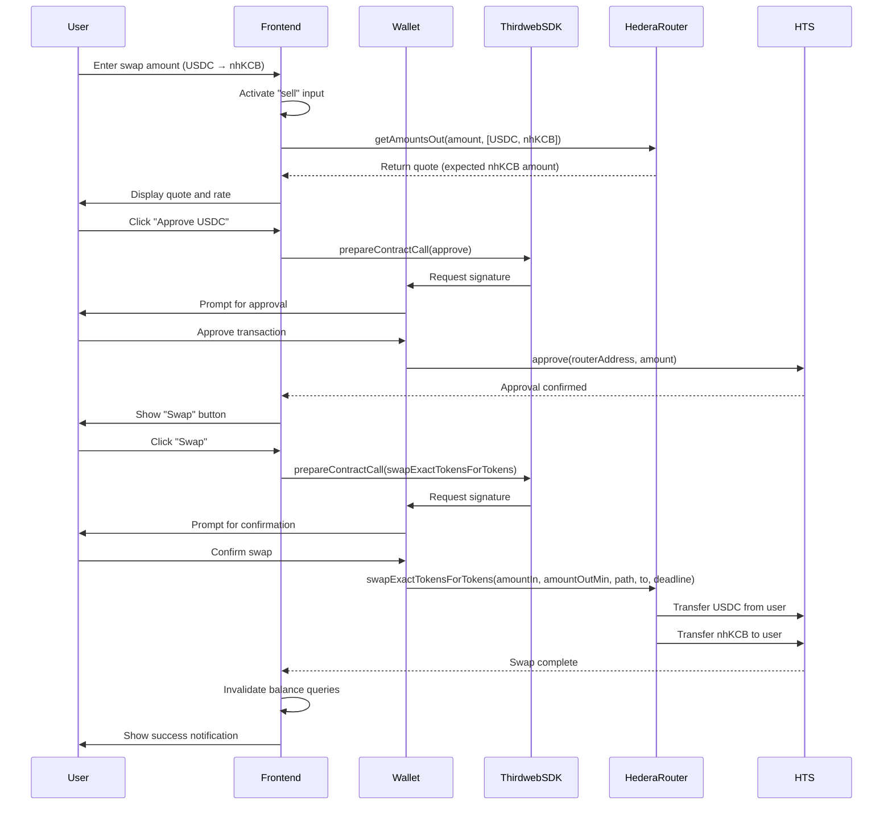
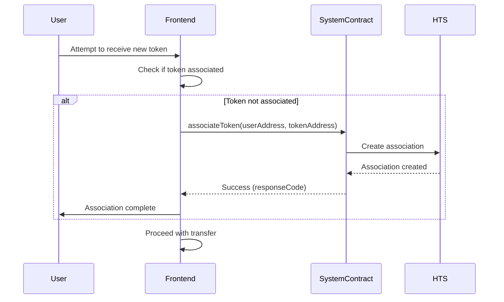
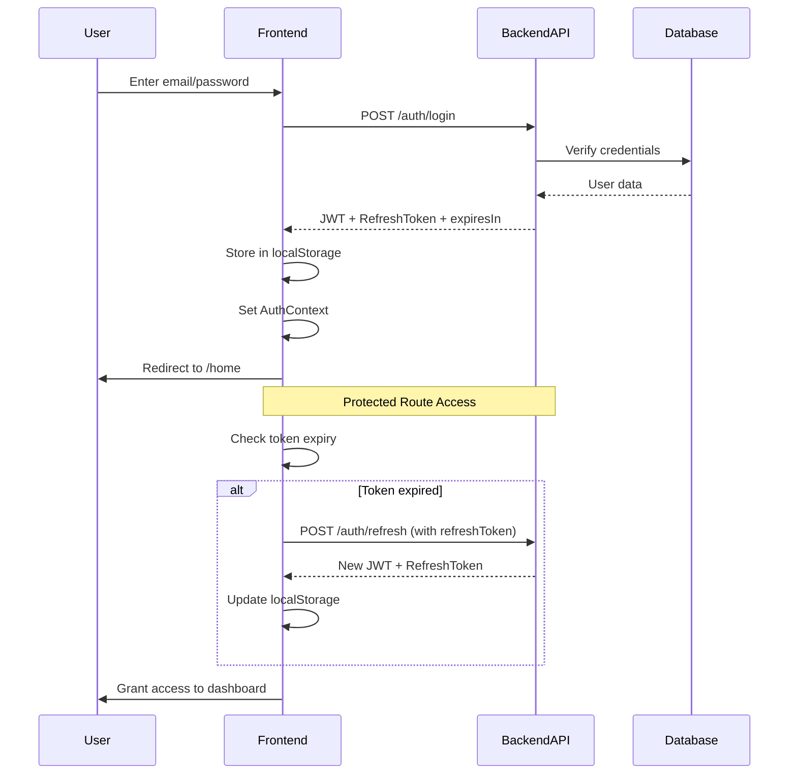

# NHX Frontend

**Tokenized Securities Trading Platform for the Nairobi Securities Exchange**

NHX Frontend is a Next.js-based decentralized application (dApp) that enables users to trade tokenized Nairobi Securities Exchange (NSE) stocks on the Hedera network. Built with modern web technologies, it provides a seamless interface for buying, selling, and swapping tokenized securities using USDC stablecoin.

[](https://nextjs.org/)
[](https://reactjs.org/)
[](https://www.typescriptlang.org/)
[](https://hedera.com/)
[](https://thirdweb.com/)

---

## Table of Contents

- [Architecture Overview](#architecture-overview)
- [Key Features](#key-features)
- [Technical Stack](#technical-stack)
- [System Architecture](#system-architecture)
- [Trading Flow](#trading-flow)
- [Smart Contract Integration](#smart-contract-integration)
- [Getting Started](#getting-started)
- [Project Structure](#project-structure)
- [API Integration](#api-integration)
- [Security](#security)
- [License](#license)

---

## Architecture Overview

NHX Frontend is built on a modern **JAMstack** architecture, leveraging Next.js 15's App Router for server-side rendering and optimal performance. The application integrates with the Hedera blockchain through Thirdweb SDK and communicates with a backend API for authentication and fiat on-ramp services.

```
┌─────────────────────────────────────────────────────────────┐
│                      User Interface Layer                    │
│  ┌─────────────┬──────────────┬──────────────┬────────────┐ │
│  │   Landing   │ Auth/Signup  │  Dashboard   │   Trading  │ │
│  │    Page     │     Flow     │   Overview   │  Interface │ │
│  └─────────────┴──────────────┴──────────────┴────────────┘ │
└─────────────────────────────────────────────────────────────┘
                              │
                              ▼
┌─────────────────────────────────────────────────────────────┐
│                   State Management Layer                     │
│  ┌──────────────────────┬──────────────────────────────────┐│
│  │  TanStack Query      │   React Context                  ││
│  │  (Server State)      │   (Auth, Theme)                  ││
│  └──────────────────────┴──────────────────────────────────┘│
└─────────────────────────────────────────────────────────────┘
                              │
                              ▼
┌─────────────────────────────────────────────────────────────┐
│                   Integration Layer                          │
│  ┌──────────────┬──────────────┬─────────────────────────┐ │
│  │  Thirdweb    │   Ethers.js  │    Backend API          │ │
│  │  SDK         │   (Hedera)   │    (Auth/Payments)      │ │
│  └──────────────┴──────────────┴─────────────────────────┘ │
└─────────────────────────────────────────────────────────────┘
                              │
                              ▼
┌──────────────────────────────────────────────────────────────────┐
│                    Blockchain Layer                          │
│  ┌──────────────────────────────────────────────────────┐  │
│  │           Hedera Testnet (Chain ID: 296)             │  │
│  │  • ATS Tokens (nhKCB, nhSCOM, nhEQTY, etc.)          │  │
│  │  • DEX Router (0x...4b40)                            │  │
│  │  • System Contracts (Token Association)              │  │
│  └──────────────────────────────────────────────────────┘  │
└──────────────────────────────────────────────────────────────────┘
```

---

## Key Features

### 🔐 **Authentication & User Management**

- JWT-based authentication with refresh token rotation
- Email/password registration with OTP verification
- Secure session management with automatic token expiry
- Protected routes with authentication guards

### 💰 **Tokenized Securities Trading**

- **Swap Interface**: Trade between USDC and tokenized NSE stocks
- **Real-time Quotes**: Dynamic pricing using Hedera DEX router
- **Supported Assets**:
  - nhKCB (KCB Group - Banking)
  - nhSCOM (Safaricom PLC - Telecommunications)
  - nhEQTY (Equity Group Holdings - Financial Services)
  - nhKEGN (Kenya Electricity Generating Company - Energy)
  - nhHAFR (Home Afrika - Real Estate)
  - nhKQ (Kenya Airways - Aviation)

### 🔄 **DEX Integration**

- **Token Approval**: ERC-20 approve pattern for secure swaps
- **Token Association**: Automatic token association via Asset Tokenization Studio system contracts
- **Slippage Protection**: Minimum output amount calculation
- **Gas Optimization**: Efficient transaction batching

### 📊 **Portfolio Management**

- Real-time portfolio balance tracking
- Asset allocation visualization
- Historical price charts with 34+ months of data
- Transaction history and activity logs

### 💱 **Multi-Currency Support**

- USDC (primary trading pair)
- KES (Kenyan Shilling) display pricing
- Exchange rate: 1 USDC = 129.15 KES

---

## Technical Stack

### **Frontend Framework**

- **Next.js 15.5.4**: React framework with App Router, Turbopack, Server Components
- **React 19.1.0**: UI library with concurrent features
- **TypeScript 5.0**: Type-safe development

### **Web3 & Blockchain**

- **Thirdweb SDK 5.108.6**: Wallet connection and transaction management
- **Ethers.js 6.15.0**: Ethereum/Hedera interaction library
- **Hedera Testnet**: Layer 1 blockchain (Chain ID: 296)

### **State Management**

- **TanStack Query 5.90.5**: Async state management and caching
- **React Context API**: Global state (auth, theme)
- **React Hook Form 7.65.0**: Form state management with Zod validation

### **UI/UX**

- **Tailwind CSS 4.0**: Utility-first styling
- **Radix UI**: Accessible component primitives
- **Motion (Framer Motion) 12.23.22**: Animation library
- **shadcn/ui**: Pre-built accessible components
- **Recharts 2.15.4**: Data visualization
- **Lottie React**: Animated illustrations

### **Additional Libraries**

- **Axios 1.12.2**: HTTP client
- **Date-fns 4.1.0**: Date manipulation
- **Zod 4.1.12**: Schema validation
- **Sonner 2.0.7**: Toast notifications

---

## System Architecture

### **Component Hierarchy**

```
app/
├── page.tsx (Landing Page)
├── layout.tsx (Root Layout)
├── login/
│   └── page.tsx (Login Flow)
├── signup/
│   └── page.tsx (Registration)
├── otp/
│   └── page.tsx (OTP Verification)
├── home/
│   └── page.tsx (User Home)
└── dashboard/
    ├── page.tsx (Dashboard Overview)
    ├── stocks/
    │   ├── [id]/page.tsx (Stock Detail)
    │   ├── buy-token.tsx
    │   ├── sell-token.tsx
    │   └── swap-tokens.tsx (Main Trading Interface)
    ├── trade/
    │   └── [id]/page.tsx
    ├── wallets/
    ├── transactions/
    ├── payments/
    └── settings/
```

### **Custom Hooks Architecture**

```typescript
hooks/
├── use-login.tsx              // Authentication
├── use-register.tsx           // User registration
├── use-swap.tsx               // DEX swap operations
│   ├── useSwapQuote()         // Price quotes
│   ├── useApproveToken()      // ERC-20 approvals
│   ├── useAssociateMutation() // HTS token association
│   └── useSwapExactTokensForTokens()
├── use-sell-tokens.tsx        // Direct token transfers
├── use-stocks-balances.tsx    // Portfolio balances
├── use-portfolio-allocation.tsx
├── use-portfolio-balance.tsx
└── use-account-activity.tsx
```

---

## Trading Flow

### **Sequence Diagram: Token Swap Transaction**



### **Token Association Flow**



### **Authentication Flow**



---

## Smart Contract Integration

### **Hedera DEX Router Interface**

The application interacts with Hedera's native DEX router for token swaps:

```typescript
// Router Contract Address
const routerEvmAddress = "0x0000000000000000000000000000000000004b40";

// Core Functions
interface IHederaDEXRouter {
  // Get expected output amounts for a swap
  getAmountsOut(amountIn: uint256, path: address[]): uint256[];

  // Execute exact input swap
  swapExactTokensForTokens(
    amountIn: uint256,
    amountOutMin: uint256,
    path: address[],
    to: address,
    deadline: uint256
  ): uint256[];
}
```

### **Asset Tokenization Studio System Contract**

For token association (required before receiving ATS tokens):

```typescript
// System Contract Address
const systemContractAddress = "0x0000000000000000000000000000000000000167";

interface IHTSSystemContract {
  // Associate token to account
  associateToken(account: address, token: address): int64; // responseCode
}
```

### **ERC-20 Token Interface**

Tokenized stocks implement standard ERC-20 interface:

```typescript
interface IERC20Token {
  approve(spender: address, amount: uint256): boolean;
  transfer(to: address, amount: uint256): boolean;
  balanceOf(account: address): uint256;
}
```

### **Token Addresses (Hedera Testnet)**

### **Token Addresses (Hedera Testnet)**

| Symbol | Token Name          | Hedera ID   |
| ------ | ------------------- | ----------- |
| USDC   | USD Coin            | 0.0.7135358 |
| nhSCOM | Safaricom Token     | 0.0.7135370 |
| nhKCB  | KCB Group Token     | 0.0.7142699 |
| nhKQ   | Kenya Airways Token | 0.0.7142834 |
| nhKEGN | KenGen Token        | 0.0.7142885 |
| nhHAFR | Home Afrika Token   | 0.0.7142913 |
| nhEQTY | Equity Group Token  | 0.0.7142958 |

---

## Getting Started

### **Prerequisites**

- **Node.js**: v20.x or higher
- **pnpm**: v8.x or higher (recommended)
- **Git**: Latest version

### **Installation**

1. **Clone the repository**

   ```bash
   git clone https://github.com/nhx-finance/frontend.git
   cd frontend
   ```

2. **Install dependencies**

   ```bash
   pnpm install
   ```

3. **Environment Setup**

   Create a `.env.local` file in the root directory:

   ```env
   # Thirdweb Configuration
   NEXT_PUBLIC_THIRDWEB_CLIENT_ID=your_thirdweb_client_id
   NEXT_PUBLIC_THIRDWEB_CLIENT_SECRET=your_thirdweb_secret

   # Backend API
   NEXT_PUBLIC_API_URL=http://localhost:8080

   # Optional: Analytics
   NEXT_PUBLIC_VERCEL_ANALYTICS_ID=your_analytics_id
   ```

4. **Run development server**

   ```bash
   pnpm dev
   ```

   Open [http://localhost:3000](http://localhost:3000)

### **Build for Production**

```bash
# Create production build
pnpm build

# Start production server
pnpm start
```

---

## Project Structure

```
frontend/
├── app/                          # Next.js App Router
│   ├── layout.tsx               # Root layout
│   ├── page.tsx                 # Landing page
│   ├── globals.css              # Global styles
│   ├── QueryProvider.tsx        # TanStack Query setup
│   ├── login/                   # Authentication routes
│   ├── signup/
│   ├── otp/
│   ├── home/
│   └── dashboard/               # Protected dashboard routes
│       ├── stocks/              # Trading interface
│       ├── wallets/
│       ├── transactions/
│       └── settings/
├── components/                   # React components
│   ├── ui/                      # shadcn/ui primitives
│   ├── landing/                 # Landing page sections
│   ├── home/                    # Dashboard components
│   ├── tables/                  # Data tables
│   ├── app-sidebar.tsx
│   ├── login-form.tsx
│   ├── signup-form.tsx
│   └── otp-form.tsx
├── hooks/                        # Custom React hooks
│   ├── use-swap.tsx             # DEX operations
│   ├── use-login.tsx
│   ├── use-register.tsx
│   ├── use-stocks-balances.tsx
│   └── use-portfolio-*.tsx
├── contexts/                     # React Context providers
│   ├── AuthContext.tsx          # Authentication state
│   └── theme-context.tsx        # Theme management
├── lib/                          # Utilities and configs
│   ├── client.ts                # Thirdweb client setup
│   ├── utils.ts                 # Helper functions
│   └── envConfig.ts             # Environment loader
├── mocks/                        # Mock data
│   ├── stocks.ts                # Stock metadata
│   ├── transactions.ts
│   └── wallets.tsx
├── abi/                          # Contract ABIs
│   └── QuoterV2.json
├── public/                       # Static assets
└── types.d.ts                    # TypeScript declarations
```

---

## API Integration

### **Authentication Endpoints**

```typescript
// Login
POST /auth/login
Request: { email: string, password: string }
Response: {
  message: string,
  email: string,
  jwtToken: string,
  refreshToken: string,
  expiresIn: number,
  refreshExpiresIn: number,
  roles: string[]
}

// Register
POST /auth/register
Request: { email: string, password: string, name: string }

// Refresh Token
POST /auth/refresh
Request: { refreshToken: string }
```

### **Client Configuration**

```typescript
// lib/client.ts
import { createThirdwebClient, defineChain } from "thirdweb";

export const client = createThirdwebClient({
  clientId: process.env.NEXT_PUBLIC_THIRDWEB_CLIENT_ID,
  secretKey: process.env.NEXT_PUBLIC_THIRDWEB_CLIENT_SECRET,
});

export const hederaTestnet = defineChain({
  id: 296,
  name: "Hedera Testnet",
  rpc: `https://testnet.hashio.io/api`,
  nativeCurrency: {
    name: "hbar",
    symbol: "HBAR",
    decimals: 8,
  },
  testnet: true,
});
```

---

## Security

### **Authentication Security**

- JWT tokens with expiration
- Refresh token rotation
- Secure localStorage handling
- Protected route guards
- Automatic session cleanup on expiry

### **Smart Contract Security**

- Two-step approval process (approve → swap)
- Deadline parameters for time-bound transactions
- Minimum output amount (slippage protection)
- Client-side wallet signature verification

### **API Security**

- CORS configuration
- Request validation with Zod schemas
- Error handling without sensitive data exposure
- Environment variables for sensitive data
- No private keys stored client-side
- User-initiated transactions only
- Clear transaction confirmations

---

## Performance Optimizations

- **Next.js Turbopack**: Faster development builds
- **Server Components**: Reduced client bundle size
- **TanStack Query Caching**: Minimized API calls
- **Lazy Loading**: Code splitting for routes
- **Image Optimization**: Next.js Image component
- **Font Optimization**: next/font with Geist

---

## Contributing

We welcome contributions! Please see our contributing guidelines.

---

## License

This project is licensed under the MIT License.

---

## Support

For questions and support:

- **GitHub Issues**: [github.com/nhx-finance/frontend/issues](https://github.com/nhx-finance/frontend/issues)
- **Email**: support@nhx.finance

---

**Built with ❤️ for the Nairobi Securities Exchange community**
